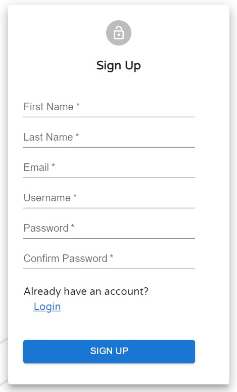
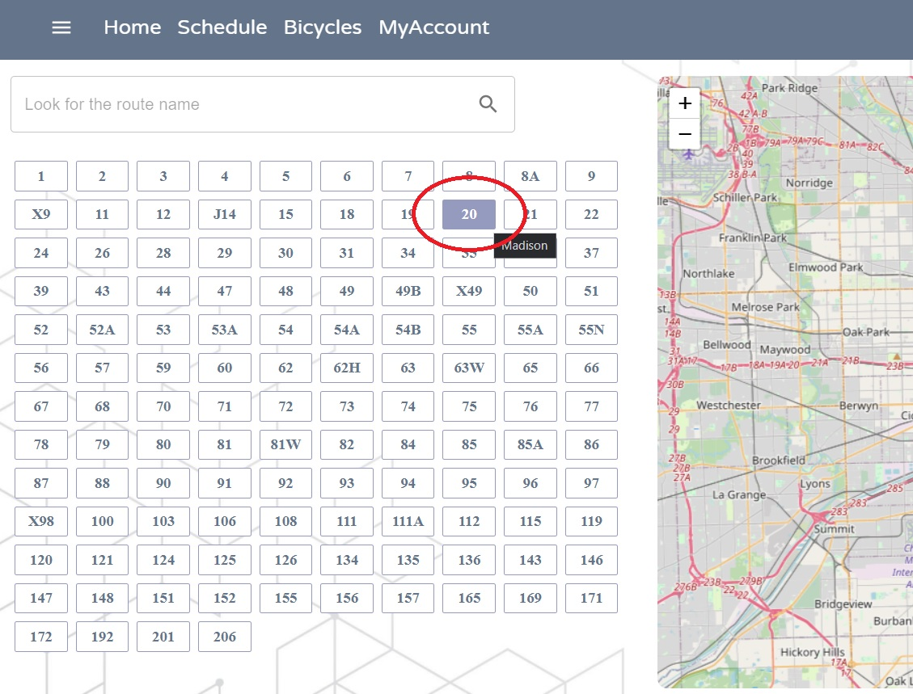
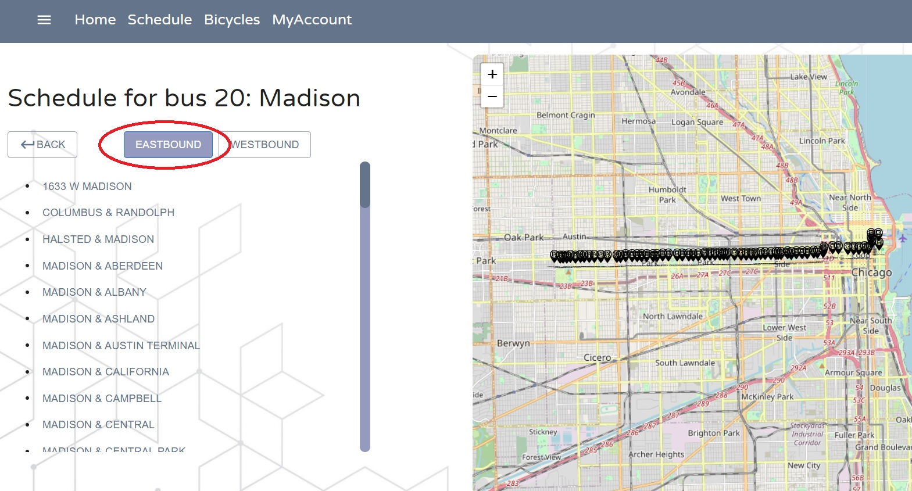
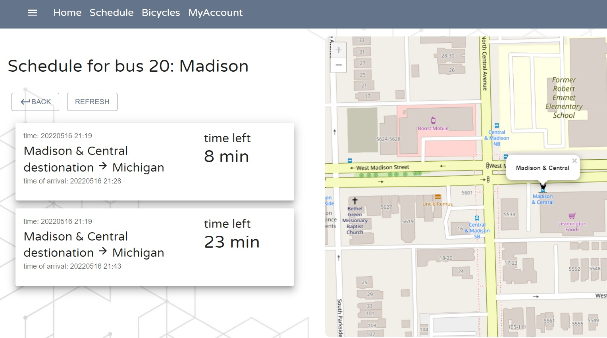

# Chicago QuickBus : React/Rails API

## Description

This project is a simple bus schedule app, showing the real time data for Chicago 
User has to create username and password to be able to use the app. 
After being successfully logged in user can browse schedule info for every bus in Chicago, which contains
time of arrival to particular stop and location of the bus stop on the map. 
User is able create shortcut for his favourite bus lines for faster access. 
Moreover user can check stations for the Divvy bicycle sharing station displayed on the map.

Data needed for creating this project are coming from CTA Bus API 
API documentation: 
https://www.transitchicago.com/developers/bustracker/
and Divvy Bikes Chicago
https://gbfs.divvybikes.com/gbfs/gbfs.json

## Requirements

- Ruby 2.7.4
- NodeJS (v16), and npm
- Heroku CLI
- Postgresql

See Environment Setup below for instructions on installing these tools if you
don't already have them.

## Setup

Start by cloning this repository to your local environment

```console
$ git clone https://github.com/Ewelajna14/transit-app your-project-name
$ cd your-project-name
```

**To run project**
```console
bundle install
rails db:create
rails db:migrate db:seed
npm install --prefix client
```


You can use the following commands to run the application:

- `rails s`: run the backend on http://localhost:3000
- `npm start --prefix client`: run the frontend on http://localhost:4000
## About the project - Frontend
Navigate to Sign up page, fill in the information to create new user.




From the home page choose Schedule,
pick the bus line you want to check timetable for



Pick the direction to see list of bus stops, see their location on the map



Check the arrivals for chosen stop and see its location on the map




## About the project - Backend

Backend is running on http://localhost:3000/

Routes are defined in routes.rb file To see this routes in browser user must be logged in otherwise you will see "Not authorized" message

Routes:  http://localhost:3000/routes

Directions: http://localhost:3000/directions

Bicycle stations http://localhost:3000/bicycles_stations

To see infortmation about currently logged in user go to: http://localhost:3000/me


Other routes are nested routes or  related witch create, update and destroy actions and can be triggered from Frontend:
create new user after submitting Sign up form

create new session after login

destroy session after log out

create favourite route for logged in user, with ability to delete it

update info for logged in user

see stops for chosen line

see predictions for choosen stop and direction


## Deploying

This application has all the starter code needed to help you deploy your
application to Heroku. It's recommended to deploy your project early and push up
changes often to ensure that your code works equally well in production and
development environments.

If you've already set up your environment to deploy to Heroku, you can run the
commands below to deploy your application. If not, make sure to check out the
Environment Setup section below.

To deploy, first log in to your Heroku account using the Heroku CLI:

```sh
heroku login
```

Create the new Heroku app:

```sh
heroku create my-app-name
```

Add the buildpacks for Heroku to build the React app on Node and run the Rails
app on Ruby:

```sh
heroku buildpacks:add heroku/nodejs --index 1
heroku buildpacks:add heroku/ruby --index 2
```

To deploy, commit your code and push the changes to Heroku:

```sh
git add .
git commit -m 'Commit message'
git push heroku main
```

> Note: depending on your Git configuration, your default branch might be named
> `master` or `main`. You can verify which by running
> `git branch --show-current`. If it's `master`, you'll need to run
> `git push heroku master` instead.

Any time you have changes to deploy, just make sure your changes are committed
on the main branch of your repo, and push those changes to Heroku to deploy
them.

You can view your deployed app with:

```sh
heroku open
```

## Environment Setup

### Install the Latest Ruby Version

Verify which version of Ruby you're running by entering this in the terminal:

```sh
ruby -v
```

Make sure that the Ruby version you're running is listed in the [supported
runtimes][] by Heroku. At the time of writing, supported versions are 2.6.8,
2.7.4, or 3.0.2. Our recommendation is 2.7.4, but make sure to check the site
for the latest supported versions.

If it's not, you can use `rvm` to install a newer version of Ruby:

```sh
rvm install 2.7.4 --default
```

You should also install the latest versions of `bundler` and `rails`:

```sh
gem install bundler
gem install rails
```

[supported runtimes]: https://devcenter.heroku.com/articles/ruby-support#supported-runtimes

### Install NodeJS

Verify you are running a recent version of Node with:

```sh
node -v
```

If your Node version is not 16.x.x, install it and set it as the current and
default version with:

```sh
nvm install 16
nvm use 16
nvm alias default 16
```

You can also update your npm version with:

```sh
npm i -g npm
```

### Sign Up for a [Heroku Account][heroku signup]

You can sign up at for a free account at
[https://signup.heroku.com/devcenter][heroku signup].

### Download the [Heroku CLI][heroku cli] Application

Download the Heroku CLI. For OSX users, you can use Homebrew:

```sh
brew tap heroku/brew && brew install heroku
```

For WSL users, run this command in the Ubuntu terminal:

```sh
curl https://cli-assets.heroku.com/install.sh | sh
```

If you run into issues installing, check out the [Heroku CLI][heroku cli]
downloads page for more options.

After downloading, you can login via the CLI in the terminal:

```sh
heroku login
```

This will open a browser window to log you into your Heroku account. After
logging in, close the browser window and return to the terminal. You can run
`heroku whoami` in the terminal to verify that you have logged in successfully.

[heroku signup]: https://signup.heroku.com/devcenter
[heroku cli]: https://devcenter.heroku.com/articles/heroku-cli#download-and-install

### Install Postgresql

Heroku requires that you use PostgreSQL for your database instead of SQLite.
PostgreSQL (or just Postgres for short) is an advanced database management
system with more features than SQLite. If you don't already have it installed,
you'll need to set it up.

#### PostgreSQL Installation for WSL

To install Postgres for WSL, run the following commands from your Ubuntu terminal:

```sh
sudo apt update
sudo apt install postgresql postgresql-contrib libpq-dev
```

Then confirm that Postgres was installed successfully:

```sh
psql --version
```

Run this command to start the Postgres service:

```sh
sudo service postgresql start
```

Finally, you'll also need to create a database user so that you are able to
connect to the database from Rails. First, check what your operating system
username is:

```sh
whoami
```

If your username is "ian", for example, you'd need to create a Postgres user
with that same name. To do so, run this command to open the Postgres CLI:

```sh
sudo -u postgres -i
```

From the Postgres CLI, run this command (replacing "ian" with your username):

```sh
createuser -sr ian
```

Then enter `control + d` or type `logout` to exit.

[This guide][postgresql wsl] has more info on setting up Postgres on WSL if you
get stuck.

[postgresql wsl]: https://docs.microsoft.com/en-us/windows/wsl/tutorials/wsl-database#install-postgresql

#### Postgresql Installation for OSX

To install Postgres for OSX, you can use Homebrew:

```sh
brew install postgresql
```

Once Postgres has been installed, run this command to start the Postgres
service:

```sh
brew services start postgresql
```

## Troubleshooting

If you ran into any errors along the way, here are some things you can try to
troubleshoot:

- If you're on a Mac and got a server connection error when you tried to run
  `rails db:create`, one option for solving this problem for Mac users is to
  install the Postgres app. To do this, first uninstall `postgresql` by running
  `brew remove postgresql`. Next, download the app from the
  [Postgres downloads page][postgres downloads page] and install it. Launch the
  app and click "Initialize" to create a new server. You should now be able to
  run `rails db:create`.

- If you're using WSL and got the following error running `rails db:create`:

  ```txt
  PG::ConnectionBad: FATAL:  role "yourusername" does not exist
  ```

  The issue is that you did not create a role in Postgres for the default user
  account. Check [this video](https://www.youtube.com/watch?v=bQC5izDzOgE) for
  one possible fix.

- If your app failed to deploy at the build stage, make sure your local
  environment is set up correctly by following the steps at the beginning of
  this lesson. Check that you have the latest versions of Ruby and Bundler, and
  ensure that Postgresql was installed successfully.

- If you deployed successfully, but you ran into issues when you visited the
  site, make sure you migrated and seeded the database. Also, make sure that
  your application works locally and try to debug any issues on your local
  machine before re-deploying. You can also check the logs on the server by
  running `heroku logs`.

For additional support, check out these guides on Heroku:

- [Deploying a Rails 6 App to Heroku][heroku rails deploying guide]
- [Rails Troubleshooting on Heroku][troubleshooting guide on heroku]

[postgres downloads page]: https://postgresapp.com/downloads.html
[heroku rails deploying guide]: https://devcenter.heroku.com/articles/getting-started-with-rails6
[troubleshooting guide on heroku]: https://devcenter.heroku.com/articles/getting-started-with-rails6#troubleshooting
